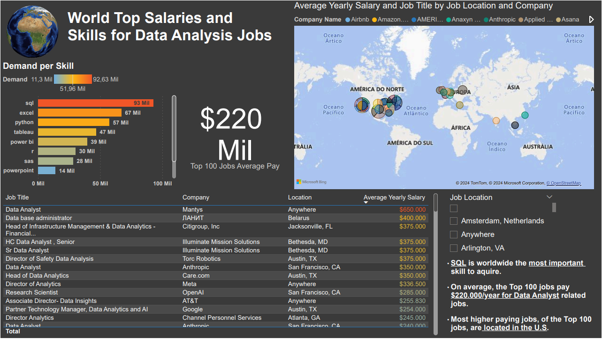
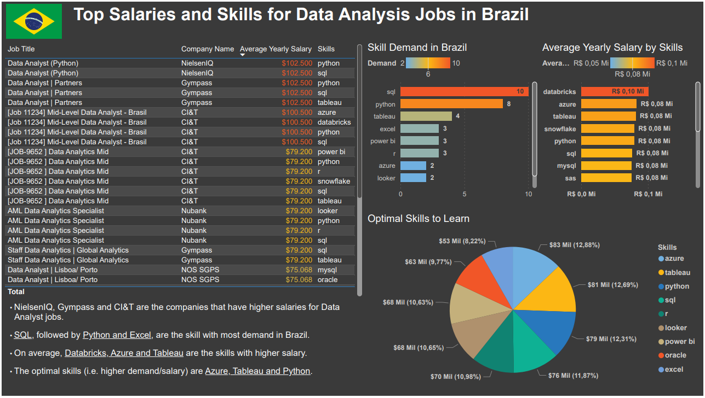

# Choose a language! Escolha um idioma!
[English](#English) :us: | [Português](#Português) 🇧🇷

# English
This is the English portion of the README.

## Introduction
This project explores the data job market, specifically for Data Analysts and has the objective
to find the top-paying jobs and most valuable skills worlwide 🌎 and for Brazil, hopefully simplifying the process for others to find ideal job opportunities.

* The analysis for Brazil was somewhat different than the worldwide one, focusing more on the salary/skill relationship instead of the companies, diversifying the results and showing different ways to analyze data.

The project was based on Luke Barousse's project, check out his [site](https://www.lukebarousse.com/sql).

## Background
The project used a larger dataset of real-world data science job postings from 2023. 
The dataset was trimmed down using SQL queries and analyzed and displayed in PowerBI.

<br /> See the SQL Queries used here: [project_sql](/project_sql/).

<br />⚠️This is a Google Drive link to download the CSV and SQL files to load the dataset: [Link](https://drive.google.com/drive/folders/1moeWYoUtUklJO6NJdWo9OV8zWjRn0rjN) into your PostgreSQL database

## Tools used 🛠️
* SQL: Allowing me to query the database and get critical insights.
* PostgreSQL: Database management system.
* Visual Studio Code: Used for database management and executing SQL queries.
* PowerBI: Used for getting insights on the data and displaying them in a visual format/report.
* Git & GitHub: Used for version control and sharing SQL scripts and analysis, ensuring collaboration and project tracking.

## Analysis 📊
* 🌎 Worlwide analysis used two separate datsets, see the codes below: 

### Top 100 best paying jobs worldwide 💰:
```sql
SELECT
    job_id,
    job_title,
    job_location,
    job_schedule_type,
    salary_year_avg,
    job_posted_date,
    name as company_name
FROM job_postings_fact
LEFT JOIN company_dim ON job_postings_fact.company_id = company_dim.company_id
WHERE job_title_short = 'Data Analyst'
AND salary_year_avg IS NOT NULL
ORDER BY salary_year_avg DESC
LIMIT 100;
```
### Top 10 most demanded skills worldwide 📈:
```sql
SELECT
    skills,
    COUNT(skills_job_dim.job_id) AS demand_count
FROM job_postings_fact
INNER JOIN skills_job_dim ON job_postings_fact.job_id = skills_job_dim.job_id
INNER JOIN skills_dim on skills_job_dim.skill_id = skills_dim.skill_id
WHERE job_title_short = 'Data Analyst'
GROUP BY skills
ORDER BY demand_count DESC
LIMIT 10;
```

* 🇧🇷 See below codes for the analysis in Brazil:
### Top paying jobs and skills in Brazil 💵:
```sql
WITH top_paying_jobs AS (
    SELECT
    job_id,
    job_title,
    salary_year_avg,
    name as company_name
    FROM job_postings_fact
    LEFT JOIN company_dim ON job_postings_fact.company_id = company_dim.company_id
    WHERE job_title_short = 'Data Analyst'
    AND job_country = 'Brazil'
    AND salary_year_avg IS NOT NULL
    ORDER BY salary_year_avg DESC
    LIMIT 100
)

SELECT top_paying_jobs.*,
    skills
FROM top_paying_jobs
INNER JOIN skills_job_dim
ON top_paying_jobs.job_id = skills_job_dim.job_id
INNER JOIN skills_dim
ON skills_job_dim.skill_id = skills_dim.skill_id
ORDER BY salary_year_avg DESC;
```

### Top average paying skills in Brazil 💹:
```sql
SELECT
    skills,
    ROUND(AVG(salary_year_avg), 0) AS salary_avg
FROM job_postings_fact
INNER JOIN skills_job_dim ON job_postings_fact.job_id = skills_job_dim.job_id
INNER JOIN skills_dim on skills_job_dim.skill_id = skills_dim.skill_id
WHERE job_title_short = 'Data Analyst'
AND salary_year_avg IS NOT NULL
AND job_country = 'Brazil'
GROUP BY skills
ORDER BY salary_avg DESC
LIMIT 10;
```

### Optimal skills to learn in Brazil 🏆:
* Top 10 skills that have the better salary and demand.
```sql
SELECT 
    skills_dim.skill_id,
    skills_dim.skills,
    COUNT(skills_job_dim.job_id) AS demand_count,
    ROUND(AVG(job_postings_fact.salary_year_avg), 0) AS avg_salary
FROM job_postings_fact
INNER JOIN skills_job_dim ON job_postings_fact.job_id = skills_job_dim.job_id
INNER JOIN skills_dim ON skills_job_dim.skill_id = skills_dim.skill_id
WHERE
    job_title_short = 'Data Analyst'
    AND salary_year_avg IS NOT NULL
    AND job_country = 'Brazil'
GROUP BY
    skills_dim.skill_id
HAVING
    COUNT(skills_job_dim.job_id) > 1
ORDER BY
    avg_salary DESC,
    demand_count DESC
LIMIT 10;
```

## Checkout the Power BI report
❗The Power BI configuration sets the numerical values to Portuguese, so the values are displayed as "Mil" or "Thousand" and "Mi" as "Millions".
Number formatting is the same as the european one. For example, one hundred thousand is written like 100.000,00 instead of 100,000.00.
<br />See the full Power BI report: [PBI](project_sql\data_job_analysis.pbix)
* Sneek Peak into the analysis for worldwide related data analist jobs:



* Sneek Peak into the analysis for the brazilian related data analist jobs:

  
## Conclusions 🤔
* The overall skills to learn are:
🥇SQL
🥈Python
🥉Tableau

* Worldwide, most Top 100 companies are in the U.S. 🗽
* The average yearly pay for these companies is 💲200,000

* In Brazil the top skills to learn are:
🥇SQL
🥈Excel
🥉Python

* Followed by visualization tools:
  * 🥇Tableau
  * 🥈Power BI

* Optimal skills to learn in Brazil:
🥇Azure
🥈Tableau
🥉Python

# Português
Esta é a parte em português do README.
## Introdução
Este projeto explora o mercado de trabalho em dados, especificamente para Analistas de Dados, com o objetivo de encontrar os empregos mais bem remunerados e as habilidades mais valiosas em todo o mundo 🌎 e para o Brasil,
com a esperança de simplificar o processo para outros encontrarem oportunidades de emprego ideais.

* A análise para o Brasil foi um pouco diferente da análise global, focando mais na relação entre salário e habilidades, em vez de nas empresas, diversificando os resultados e mostrando diferentes maneiras de analisar dados.

O projeto foi baseado no projeto de Luke Barousse, confira o site dele: [site](https://www.lukebarousse.com/sql).

## Contexto
O projeto utilizou um conjunto de dados maior de vagas de emprego em ciência de dados do mundo real de 2023.
O conjunto de dados foi reduzido usando consultas SQL e analisado e exibido no PowerBI.

<br /> Veja as consultas SQL usadas aqui: [project_sql](/project_sql/).

<br />⚠️ Este é um link do Google Drive para baixar os arquivos CSV e SQL para carregar o conjunto de dados: [Link](https://drive.google.com/drive/folders/1moeWYoUtUklJO6NJdWo9OV8zWjRn0rjN).

## Ferramentas utilizadas 🛠️
* SQL: Me permitiu consultar o banco de dados e obter insights críticos.
* PostgreSQL: Sistema de gerenciamento de banco de dados.
* Visual Studio Code: Usado para gerenciamento de banco de dados e execução de consultas SQL.
* PowerBI: Usado para obter insights nos dados e exibi-los em formato visual/relatório.
* Git & GitHub: Usado para controle de versão e compartilhamento de scripts SQL e análises, garantindo colaboração e acompanhamento do projeto.

## Análise 📊
🌎 A análise global utilizou dois conjuntos de dados separados, veja os códigos abaixo:

### Top 100 empregos mais bem pagos no mundo 💰:
```sql
SELECT
    job_id,
    job_title,
    job_location,
    job_schedule_type,
    salary_year_avg,
    job_posted_date,
    name as company_name
FROM job_postings_fact
LEFT JOIN company_dim ON job_postings_fact.company_id = company_dim.company_id
WHERE job_title_short = 'Data Analyst'
AND salary_year_avg IS NOT NULL
ORDER BY salary_year_avg DESC
LIMIT 100;
```
### Top 10 habilidades mais demandadas no mundo 📈:
```sql
SELECT
    skills,
    COUNT(skills_job_dim.job_id) AS demand_count
FROM job_postings_fact
INNER JOIN skills_job_dim ON job_postings_fact.job_id = skills_job_dim.job_id
INNER JOIN skills_dim on skills_job_dim.skill_id = skills_dim.skill_id
WHERE job_title_short = 'Data Analyst'
GROUP BY skills
ORDER BY demand_count DESC
LIMIT 10;
```

* 🇧🇷 Veja abaixo os códigos para a análise no Brasil:
### Empregos e habilidades mais bem pagos no Brasil 💵:
```sql
WITH top_paying_jobs AS (
    SELECT
    job_id,
    job_title,
    salary_year_avg,
    name as company_name
    FROM job_postings_fact
    LEFT JOIN company_dim ON job_postings_fact.company_id = company_dim.company_id
    WHERE job_title_short = 'Data Analyst'
    AND job_country = 'Brazil'
    AND salary_year_avg IS NOT NULL
    ORDER BY salary_year_avg DESC
    LIMIT 100
)

SELECT top_paying_jobs.*,
    skills
FROM top_paying_jobs
INNER JOIN skills_job_dim
ON top_paying_jobs.job_id = skills_job_dim.job_id
INNER JOIN skills_dim
ON skills_job_dim.skill_id = skills_dim.skill_id
ORDER BY salary_year_avg DESC;
```

### Principais habilidades salariais médias no Brasil 💹:
```sql
SELECT
    skills,
    ROUND(AVG(salary_year_avg), 0) AS salary_avg
FROM job_postings_fact
INNER JOIN skills_job_dim ON job_postings_fact.job_id = skills_job_dim.job_id
INNER JOIN skills_dim on skills_job_dim.skill_id = skills_dim.skill_id
WHERE job_title_short = 'Data Analyst'
AND salary_year_avg IS NOT NULL
AND job_country = 'Brazil'
GROUP BY skills
ORDER BY salary_avg DESC
LIMIT 10;
```

### Habilidades ideais para aprender no Brasil 🏆:
* As 10 principais habilidades que têm melhor salário e demanda.
```sql
SELECT 
    skills_dim.skill_id,
    skills_dim.skills,
    COUNT(skills_job_dim.job_id) AS demand_count,
    ROUND(AVG(job_postings_fact.salary_year_avg), 0) AS avg_salary
FROM job_postings_fact
INNER JOIN skills_job_dim ON job_postings_fact.job_id = skills_job_dim.job_id
INNER JOIN skills_dim ON skills_job_dim.skill_id = skills_dim.skill_id
WHERE
    job_title_short = 'Data Analyst'
    AND salary_year_avg IS NOT NULL
    AND job_country = 'Brazil'
GROUP BY
    skills_dim.skill_id
HAVING
    COUNT(skills_job_dim.job_id) > 1
ORDER BY
    avg_salary DESC,
    demand_count DESC
LIMIT 10;
```

## Confira o relatório Power BI
❗ Apesar do relatório estar em Inglês, as configurações do Power BI definem os valores numéricos para Português, então os valores são exibidos como "Mil" ou "Milhar" e "Mi" como "Milhões".
<br /> Veja o relatório completo do Power BI: [PBI](project_sql\data_job_analysis.pbix)

* Recorte da análise de empregos relacionados a analistas de dados em todo o mundo:


* Recorte da análise de empregos relacionados a analistas de dados no Brasil:


## Conclusões 🤔
* As habilidades mais importantes para aprender são:
🥇SQL
🥈Python
🥉Tableau

* Globalmente, a maioria das 100 principais empresas está nos EUA 🗽

* O salário médio anual para essas empresas é de 💲200.000

* No Brasil, as principais habilidades para aprender são:
🥇SQL
🥈Excel
🥉Python

* Seguidas por ferramentas de visualização:

  *🥇Tableau
  *🥈Power BI

* Habilidades ideais para aprender no Brasil:
🥇Azure
🥈Tableau
🥉Python
